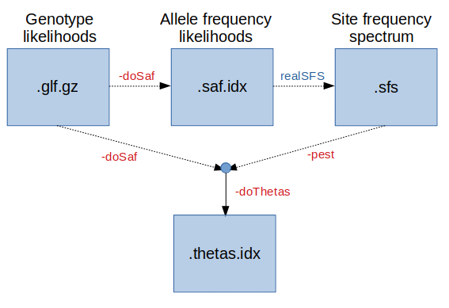

#### 3. Nucleotide diversity

We are also interested in assessing whether an increase in allele frequency differentiation is also associated with a change of **nucleotide diversity** in JIGA.
Again, we can achieve this using ANGSD by estimating levels of diversity without relying on called genotypes.

The procedure is similar to what done for PBS, and the SFS is again used as a prior to compute allele frequencies probabilities.
From these quantities, expectations of various diversity indexes are compute.
This can be achieved using the following pipeline.



First we compute the allele frequency posterior probabilities and associated statistics (-doThetas) using the SFS as prior information (-pest)
```
POP=JIGA
angsd -b $DIR/$POP'_bams.txt' -ref $REF -anc $ANC -out Results/$POP \
	-uniqueOnly 1 -remove_bads 1 -only_proper_pairs 1 -trim 0 -C 50 \
	-minMapQ 20 -minQ 20 -minInd 5 -setMinDepth 5 -setMaxDepth 60 -doCounts 1 \
	-GL 1 -doSaf 1 \
	-doThetas 1 -pest Results/$POP.sfs
```


Then we need to index these files and perform a sliding windows analysis using a window length of 10kbp and a step size of 1kbp.
```
POP=JIGA
# estimate for the whole region
thetaStat do_stat Results/$POP.thetas.idx
# perform a sliding-window analysis
thetaStat do_stat Results/$POP.thetas.idx -win 10000 -step 1000 -outnames Results/$POP.thetas.windows
```

Look at the results:
```
cat Results/JIGA.thetas.idx.pestPG
```
```
less -S Results/JIGA.thetas.windows.pestPG
```

The output contains many different columns: 

`#(indexStart,indexStop)(firstPos_withData,lastPos_withData)(WinStart,WinStop)   Chr     WinCenter       tW      tP      tF      tH      tL      Tajima  fuf     fud     fayh    zeng    nSites`

but we will only focus on a few here:

`Chr, WinCenter, tW, tP, Tajima and nSites`

`Chr` and `WinCenter` provide the chromosome and basepair coordinates for each window and `nSites` tells us how many genotyped sites (variant and invariant) are present in each 10kb. `tW` and `tP` are estimates of theta, namely Watterson's theta and pairwise theta. `tP` can be used to estimate the window-based pairwise nucleotide diversity (π), when we divide `tP` by the number of sites within the corresponding window (`-nSites`). 
Furthermore, the output also contains multiple neutrality statistics. As we used an outgroup to polarise the spectrum, we can theoretically look at all of these. When you only have a folded spectrum, you can't correctly estimate many of these neutrality statistics, such as Fay's H (`fayH`). However, Tajima's D (`Tajima`) can be estimated using the folded or unfolded spectrum.   

**QUESTION**
Do regions with increased PBS values in JIGA (PBS02) correspond to regions with low Tajima's D and reduced nucleotide diversity? If so, this would be additional evidence for positive selection in JIGA. 

**EXERCISE**
Estimate the nucleotide diversity for MAQU. How do pattern of nucleotide diversity differ between MAQU and JIGA? 
Produce a plot of this sliding windows analysis.

You have now learnt how to estimate several metrics of nucleotide diversity and tests for selection from low-coverage data.
Well done!

------------------------


