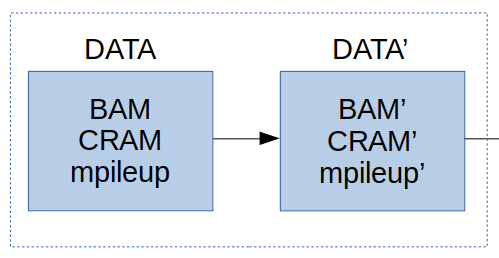

#### 1. Data filtering and I/O

First, we will learn **how to build a command line in ANGSD**.



To see a full list of options in ANGSD type:
```
angsd
```
and you should see something like
```
...
Overview of methods:
	-GL		Estimate genotype likelihoods
	-doCounts	Calculate various counts statistics
	-doAsso		Perform association study
	-doMaf		Estimate allele frequencies
	-doError	Estimate the type specific error rates
	-doAncError	Estimate the errorrate based on perfect fastas
	-HWE_pval	Est inbreedning per site or use as filter
	-doGeno		Call genotypes
	-doFasta	Generate a fasta for a BAM file
	-doAbbababa	Perform an ABBA-BABA test
	-sites		Analyse specific sites (can force major/minor)
	-doSaf		Estimate the SFS and/or neutrality tests genotype calling
	-doHetPlas	Estimate hetplasmy by calculating a pooled haploid frequency

	Below are options that can be usefull
	-bam		Options relating to bam reading
	-doMajorMinor	Infer the major/minor using different approaches
	-ref/-anc	Read reference or ancestral genome
	-doSNPstat	Calculate various SNPstat
	-cigstat	Printout CIGAR stat across readlength
	many others

Output files:
	 In general the specific analysis outputs specific files, but we support basic bcf output
	-doBcf		Wrapper around -dopost -domajorminor -dofreq -gl -dovcf docounts
For information of specific options type: 
	./angsd METHODNAME eg 
		./angsd -GL
		./angsd -doMaf
		./angsd -doAsso etc
		./angsd sites for information about indexing -sites files
Examples:
	Estimate MAF for bam files in 'list'
		'./angsd -bam list -GL 2 -doMaf 2 -out RES -doMajorMinor 1'
```

ANGSD can accept several input files, as described [here](http://popgen.dk/angsd/index.php/Input):

* BAM, CRAM, mpileup
* VCF, GLF, beagle

Here we show how ANGSD can also perform some basic filtering of the data.
These filters are based on:

* quality and depth, see [here](http://www.popgen.dk/angsd/index.php/Filters)
* SNP quality, see [here](http://popgen.dk/angsd/index.php/SnpFilters)
* sites, see [here](http://popgen.dk/angsd/index.php/Sites)

Have a look at our list of BAM files:
```
cat $DIR/ALL_bams.txt
wc -l $DIR/ALL_bams.txt
ls $DIR/*_bams.txt
```

If the input file is in BAM format, the possible options are:
```
angsd -bam
...
parseArgs_bambi.cpp: bam reader:
	-bam/-b		(null)	(list of BAM/CRAM files)
	-i		(null)	(Single BAM/CRAM file)
	-r		(null)	Supply a single region in commandline (see examples below)
	-rf		(null)	Supply multiple regions in a file (see examples below)
	-remove_bads	1	Discard 'bad' reads, (flag >=256) 
	-uniqueOnly	0	Discards reads that doesn't map uniquely
	-show		0	Mimic 'samtools mpileup' also supply -ref fasta for printing reference column
	-minMapQ	0	Discard reads with mapping quality below
	-minQ		13	Discard bases with base quality below
	-trim		0	Number of based to discard at both ends of the reads
	-trim		0	Number of based to discard at 5' ends of the reads
	-trim		0	Number of based to discard at 3' ends of the reads
	-only_proper_pairs 1	Only use reads where the mate could be mapped
	-C		0	adjust mapQ for excessive mismatches (as SAMtools), supply -ref
	-baq		0	adjust qscores around indels (1=normal baq 2= extended(as SAMtools)), supply -ref
	-redo-baq		0 (recompute baq, instead of using BQ tag)
	-checkBamHeaders 1	Exit if difference in BAM headers
	-doCheck	1	Keep going even if datafile is not suffixed with .bam/.cram
	-downSample	0.000000	Downsample to the fraction of original data
	-nReads		50	Number of reads to pop from each BAM/CRAMs
	-minChunkSize	250	Minimum size of chunk sent to analyses
	--ignore-RG	1	(dev only)
	+RG	(null)	Readgroups to include in analysis(can be filename)

Examples for region specification:
		chr:		Use entire chromosome: chr
		chr:start-	Use region from start to end of chr
		chr:-stop	Use region from beginning of chromosome: chr to stop
		chr:start-stop	Use region from start to stop from chromosome: chr
		chr:site	Use single site on chromosome: chr
```

First we need to define input and output files (please note that here we do not run these intermediate steps, as you can see thare is a ```#``` in the front):
```
# angsd -b ALL.bams -ref $REF -out Results/ALL \
...
```
with
`-b` we give the file including paths to all BAM files we need to analyse, 
`-ref` specifies the reference sequence,
`-out` states the prefix for all output files that will be generated.

Next we need to define some basic filtering options.
First we define filters based on reads quality.
```
# angsd -b ALL.bams -ref $REF -out Results/ALL \
#        -uniqueOnly 1 -remove_bads 1 -only_proper_pairs 1 -trim 0 -C 50 -baq 1 \
...
```
These filters will retain only uniquely mapping reads, not tagged as bad, considering only proper pairs, without trimming, and adjusting for indel/mapping (as in samtools).
`-C 50` reduces the effect of reads with excessive mismatches, while `-baq 1` computes base alignment quality as explained here ([BAQ](http://samtools.sourceforge.net/mpileup.shtml)) used to rule out false SNPs close to INDELS.

Also, you may want to remove reads with low mapping quality and sites with low quality or covered by few reads (low depth).
Under these circumnstances, the assignment of individual genotypes and SNPs is problematic, and can lead to errors.
We may also want to remove sites where a fraction (half?) of the individuals have no data.
This is achieved by the ```-minInd``` option.


A possible command line would contain the following filtering:
```
...
# angsd -b ALL.bams -ref $REF -out Results/ALL \
#        -uniqueOnly 1 -remove_bads 1 -only_proper_pairs 1 -trim 0 -C 50 -baq 1 \
#        -minMapQ 20 -minQ 20 -minInd 5 -setMinDepth 7 -setMaxDepth 30 -doCounts 1 \
...
```
which corresponds to the following scenario:

Parameter | Meaning |
--- | --- |
-minInd 5 | use only sites with data from at least N individuals |
-setMinDepth 7 | minimum total depth |
-setMaxDepth 30 | maximum total depth |

More sophisticated filtering can be done, but this is outside the scope of this practical.

You have learnt how to build a basic pipeline in ANGSD.
Next you are going to learn how to calculate genotype likelihoods in ANGSD.

[click here](https://github.com/nt246/lcwgs-guide-tutorial/blob/main/tutorial2_genotype_snp_calling/markdowns/02_likelihoods.md) to move to the next session.

---------------------------------------


